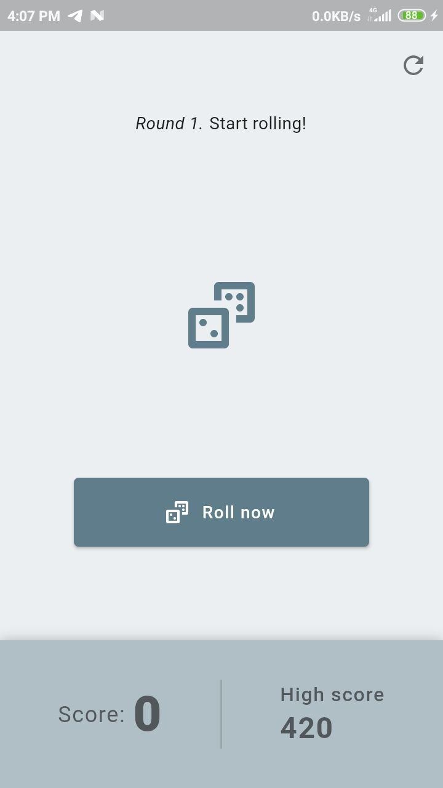
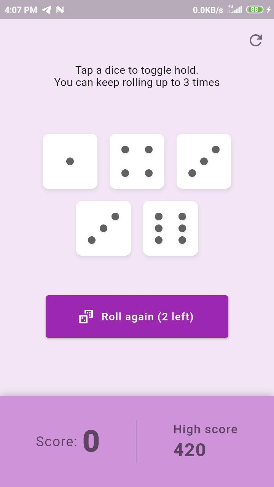
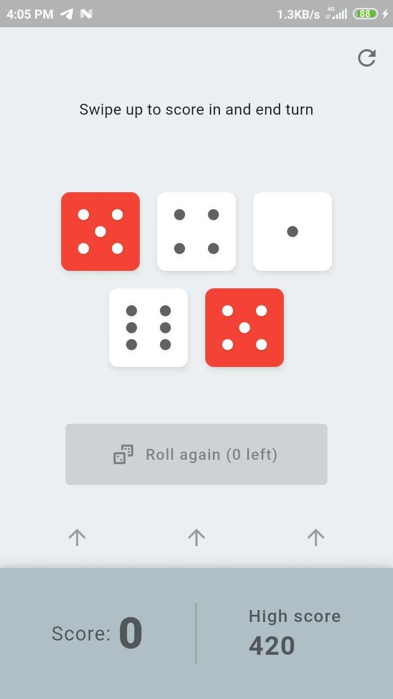
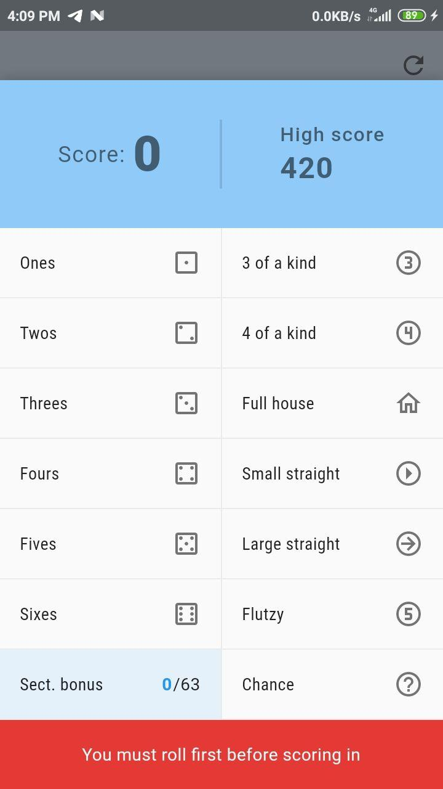
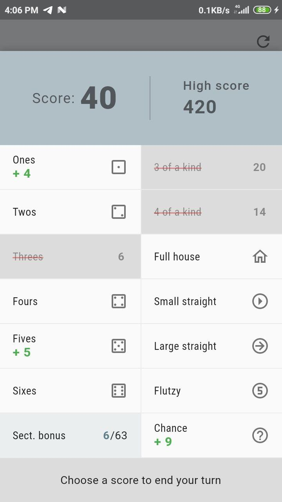

# Flutzy

A dice game based on Yahtzee/Yatzy, built with Flutter.

---

## How to play

The gameplay and rules are quite similar to original [Yahtzee](https://en.wikipedia.org/wiki/Yahtzee), although not all rules are fully implemented yet.

The game is playable on mobile (Android/iOS) and the web browser (https://akmal02.github.io/flutzy), in which an alternative layout is available for landscape screens.

## Features

Background colors change randomly on each start of the game.

_More to be added later._
